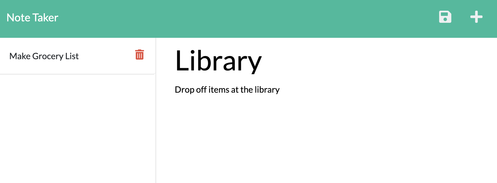

# Note-taker

  ## Description
  This application can be used to write and save notes.  It uses Express.js to save and retrieve note data from a JSON file.  You can add a note title, and the note itself then save it.  UUID creates an unique ID to each note, so then you are able to delete the notes as you finish the tasks.

  ## Installation
  To install required dependecies, use: npm install 

  ## Usage
  Click through the homepage and you'll be taken to where the notes are stored.  
  
  
  <a href="https://gentle-cliffs-95734.herokuapp.com/">Here is the deloyed site</a>

 ## Built With
 This application is built with:  
 * HTML
 * CSS
 * Bootstrap
 * JavaScript
 * JQuery
 * Node.js
 * Express.js
 * uuid

  ## Questions
  If you have any questions, please reach out on <a href="https://github.com/sacylkowski/">GitHub</a> or you can <a href="mailto:sacylkowski@gmail.com">E-mail me</a>.

